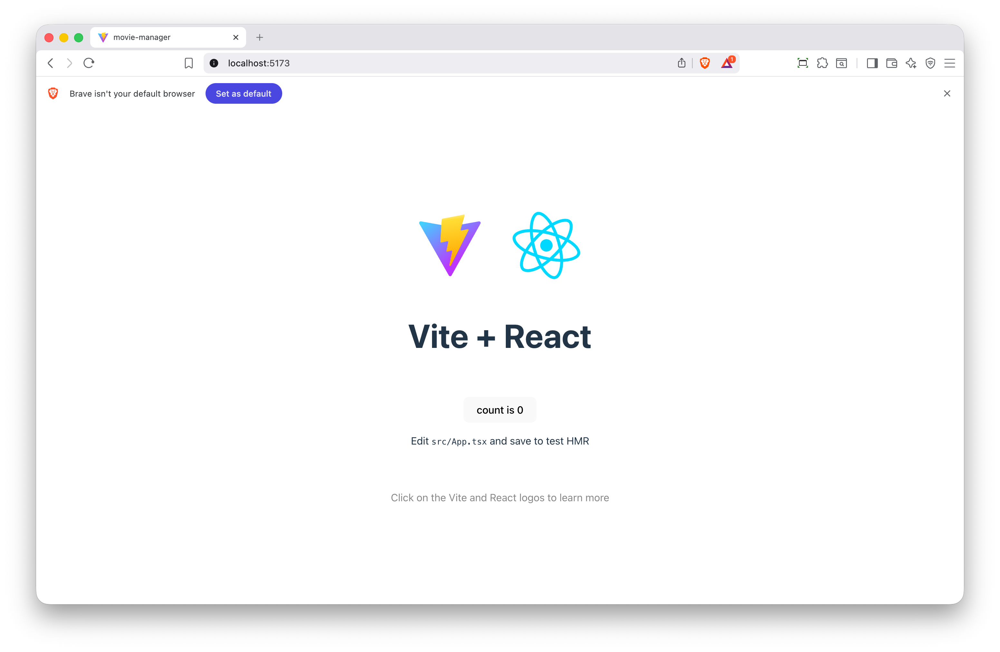
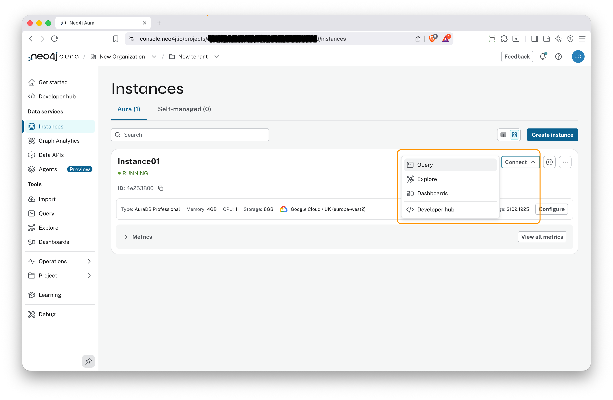
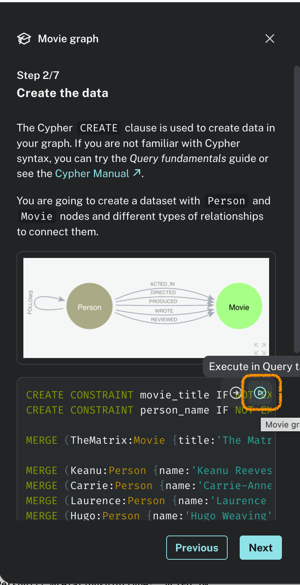

# Chapter 1: Set Up Your Environment

In this chapter, you'll set up your development environment, create a React application from templated, and provision a GraphQL Data API for a Neo4j Aura instance. 

> It is assumed that you have a local copy of this repository.  If you have not, then clone it now
> - ```git clone https://github.com/LackOfMorals/movie-manager.git```
> 
> And then move into this chapter
> - ```cd movie-manager/chapter1```


## Install Required Dependencies

Install the packages you'll need for this tutorial.  Make sure you are in the ```movie-manager/chapter1``` folder and then. 

```bash
npm install
```

And wait for all of the packages to install.

The packages being installed that are of interest are:- 
- **graphql-request**: A lightweight GraphQL client for making requests
- **graphql**: Core GraphQL functionality
- **@tanstack/react-query**: Powerful data fetching and caching
- **@tanstack/react-query-devtools**: Development tools for debugging queries
- **tailwindcss**:  Styling for our application using the popular tailwind package


> ℹ️ ***Note*** To setup a React application with all of the needed packages from the very start, do this at a prompt
> - ```npm create vite@latest movie-manager -- --template react-ts```
> - ```cd movie-manager```
> - ```npm install```
> - ```npm install graphql-request graphql```
> - ```npm install @tanstack/react-query```
> - ```npm install -D @tanstack/react-query-devtools```
> - ```npm install -D tailwindcss@3 postcss autoprefixer```
> - ```npx tailwindcss init -p```


At this point you can check if everything is ok by typing ```npm run dev``` , enter ```http:localhost:5173``` in your browser and you will see a blank web page like this




## Set Up Your Neo4j Database

### Load the Movies Dataset

1. Log in to your [Neo4j Aura Console](https://console.neo4j.io/)
2. Open your database instance
3. Select "Connect" and then "Query" to open the Neo4j Browser

4. When the  Welcome message is shown, select "Try Neo4j with the Movie Graph"

5. Follow the instructions on "Step 2 Create the data". There are several Cypher statements shown.  At the top of those, there is a arrow head in a circle. Select that to create the Movie graph in your database.



### Enable DataAPI GraphQL

1. In the Aura Console, under Data services, select "Data APIs"
2. Click on the "Create API"
3. Complete the form as follows
	- API Name: MovieGraphQL
	- Instance: <The name of your Neo4j instance with the Movie Graph>
	- Instance permissions: Choose "Read & Write"
	- Select "Enable introspection"
	- Type defintions:  Copy and paste the following

```typescript
type ActedInProperties @relationshipProperties {
    roles: [String!]!
}

type Movie @node {
    peopleActedIn: [Person!]! @relationship(type: "ACTED_IN", direction: IN, properties: "ActedInProperties")
    peopleDirected: [Person!]! @relationship(type: "DIRECTED", direction: IN)
    peopleProduced: [Person!]! @relationship(type: "PRODUCED", direction: IN)
    peopleReviewed: [Person!]! @relationship(type: "REVIEWED", direction: IN, properties: "ReviewedProperties")
    peopleWrote: [Person!]! @relationship(type: "WROTE", direction: IN)
    released: Int!
    tagline: String
    title: String!
}

type Person @node {
    actedInMovies: [Movie!]! @relationship(type: "ACTED_IN", direction: OUT, properties: "ActedInProperties")
    born: Int
    directedMovies: [Movie!]! @relationship(type: "DIRECTED", direction: OUT)
    followsPeople: [Person!]! @relationship(type: "FOLLOWS", direction: OUT)
    name: String!
    peopleFollows: [Person!]! @relationship(type: "FOLLOWS", direction: IN)
    producedMovies: [Movie!]! @relationship(type: "PRODUCED", direction: OUT)
    reviewedMovies: [Movie!]! @relationship(type: "REVIEWED", direction: OUT, properties: "ReviewedProperties")
    wroteMovies: [Movie!]! @relationship(type: "WROTE", direction: OUT)
}

type ReviewedProperties @relationshipProperties {
    rating: Int!
    summary: String!
}
```

-
	- Select "Add allowed origin" and enter http://localhost:5173.  This is the address the Movie Management website uses.
	- Under Authentication Providers, select "Add authentication provider".  
	- Make sure Type is set to "API Key" and enter a name of "MovieGraphQLKey".  This will control access. 
	- Select "Create"
4. Select "Download and continue" to download connnection information to a local text file. 
5. The creation process will take a few minutes. 


## Configure Your Application

Create a `.env` file in the root of your project:

```bash
touch .env
```

Add your Neo4j DataAPI GraphQL endpoint information, found in the download file, to `.env`:

```env
VITE_NEO4J_GRAPHQL_URL=YOUR_DATA_API_URL
VITE_NEO4J_GRAPHQL_TOKEN=YOUR_DATA_API_AUTH_PROVIDER_API_KEY
```

>  **Important**: Never commit your `.env` file to version control. It's already included in the `.gitignore` file created by Vite.

## Test connectivity

Using CURL you can quickly check that the DataAPI is working.  Enter the following into a command prompt, changing YOUR_DATA_API_URL and YOUR_DATA_API_AUTH_PROVIDER_API_KEY to match your values

```bash
curl --location YOUR_DATA_API_URL\
  --header 'Content-Type: application/json' \
  --header 'x-api-key: YOUR_DATA_API_AUTH_PROVIDER_API_KEY' \
  --data '{"query": "query GetMovies { movies { title }}"}'
```

This GraphQL query lists all movies with their title. 


If everything works, you're ready to move on to the next chapter!

## What You've Accomplished

✅ Created a React + TypeScript application  
✅ Installed necessary dependencies  
✅ Set up a Neo4j database with the Movies dataset  
✅ Enabled DataAPI GraphQL  
 
**Next**: [Chapter 2: Read Data from Neo4j](#chapter-2-read-data-from-neo4j)

---